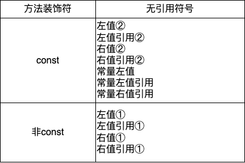

# 非静态成员函数重载问题

除构造函数、析构函数、自定义转换函数外，类的非静态成员函数第一个参数都是隐式的类对象本身。而对象的类型，决定了成员函数的重载。调用成员函数时，对象本身由三个维度确定具体类型：`const`与`non-const`, 左值与右值，引用与非引用，这些对象的实际类型与成员方法的定义类型，最终决定了重载方式。这个问题实则复杂，若要更精细的管理类的行为，有必要弄清楚详细的重载细则。本文试图在实验结果的基础上理清楚这个问题。

三个原则：
- 方法重载的优先级。C++标准为各种成员方法的重载规定了`fallback`，这些`fallback`的行为增加了问题的复杂程度。同一个对象可以重载带不同修饰符的方法，区别在于优先级不同，本文也会搞清楚重载的优先级。
- 引用修饰符不能与不带引用修饰符的方法重载。一个类的方法要么带引用修饰符`&`，或者`&&`，要么不带任何引用修饰符，二者不能共存；带`&`和`&&`的同名方法可以重载。
- 非常量修饰的方法无法被任何常量修饰的对象调用。`const`修饰的方法可能被普通对象调用，反之不成立。

# 无引用修饰符的情况

无引用修饰符的情况下只有`const`和非`const`两种情况：

